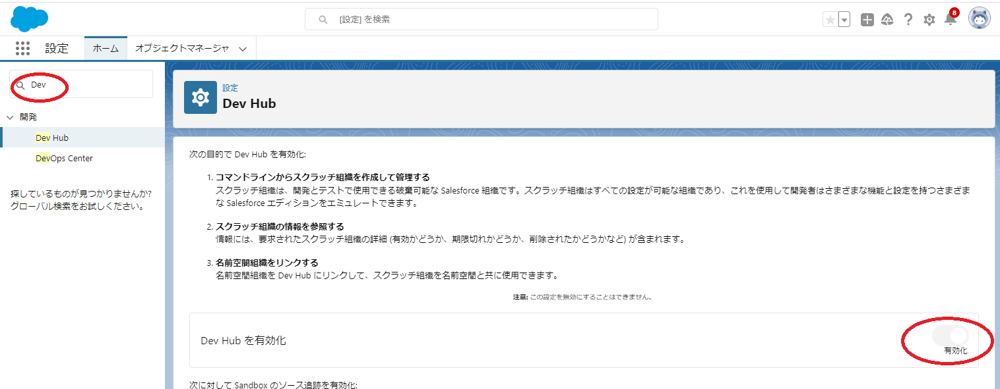

# MySfdxPractice

## 準備(Salesforce DevHub側)
* 組織上でDev Hub組織を有効化する
  * クイック検索「Dev Hub」→Dev Hubタブ→「Dev Hub を有効」<br>
  **※注意：一度有効化したら元に戻せない**<br>
  

## 準備(Git~)
* プロジェクトをclone

* 以下コマンドを実行する
```
npm install
```

* cloneしてきたディレクトリへ移動してDevHub組織を認証
```
sf auth web login -r orgURL -d -a MyDevHub
```
* スクラッチ組織作成
```
sf org create scratch -f config/project-scratch-def.json -a myScratch
```
* スクラッチ組織を開く
```
sf org open -o myScratch
```

* 組織にソースをpushする
```
sf project deploy start -o myScratch
```

* 組織からソースをpullする
```
sf project retrieve start -o myScratch
```

* 開発準備用apex実行
```
# 権限セット設定
sf apex run -f scripts/apex/setupPermissionSet.apex -o myScratch
# サンプルデータ設定
sf apex run -f scripts/apex/setupData.apex -o myScratch
```

* 開発環境構築_スクリプト版(スクラッチ環境作成～設定用Apex実行)
```
sh scripts/preparation.sh myScratch
```

* スクラッチ組織のパスワード生成
```
sf org list
sf org generate password -o <username>
sf org display -o <orgName>
```

* スクラッチ組織の削除
```
sf org scratch delete -o <orgname>
```

* workbenchによるREST API実行
```
# 以下のURLから実行可能
https://workbench.developerforce.com/login.php
# REST Explorerを選択して以下でExecute
/services/apexrest/<className>/<methodName>
```
